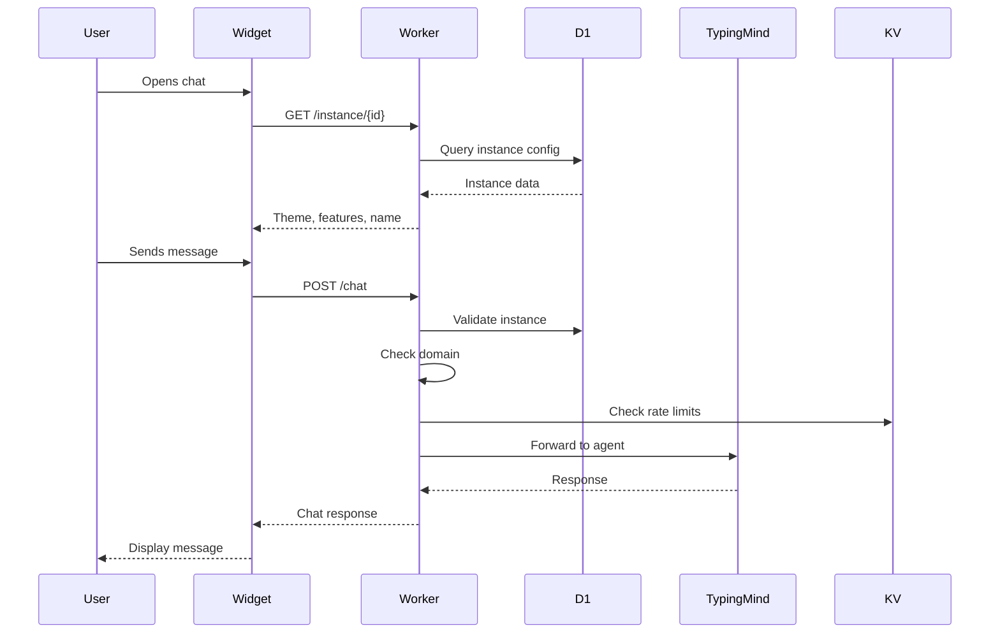
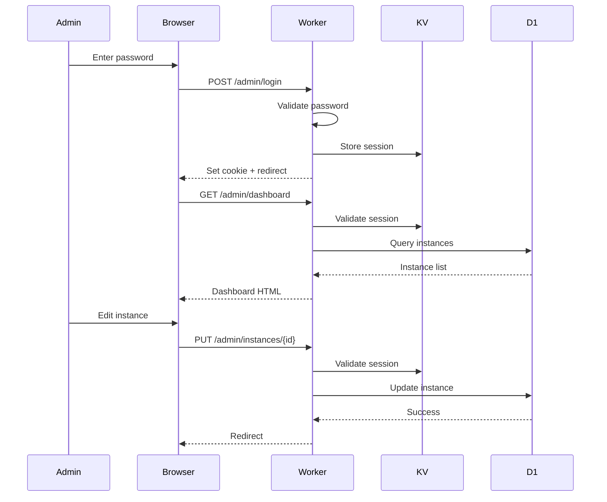

# TypingMind Multi-Instance Chatbot Platform - Architecture

## Overview

This document describes the architecture of a multi-instance embeddable chatbot platform that allows deploying multiple configurations of TypingMind agents across different websites with centralized management.

## System Architecture

```
┌─────────────────┐     ┌──────────────────┐     ┌─────────────────────┐
│  Website Users  │────▶│  Chat Widgets    │────▶│ Cloudflare Workers  │
│  (No Auth)      │◀────│  (Shadow DOM)    │◀────│ ┌─────────────────┐ │
└─────────────────┘     └──────────────────┘     │ │ Instance Router │ │
                                                  │ └─────────────────┘ │
                                                  │ ┌─────────────────┐ │
                                                  │ │   D1 Database   │ │
                                                  │ │   (Instances)   │ │
                                                  │ └─────────────────┘ │
                                                  │ ┌─────────────────┐ │
                                                  │ │   KV Storage    │ │
                                                  │ │(Widget & Cache) │ │
                                                  │ └─────────────────┘ │
                                                  └──────────┬──────────┘
                                                             │
                                                             ▼
                                                  ┌─────────────────────┐
                                                  │   TypingMind API    │
                                                  │  Multiple Agents    │
                                                  └─────────────────────┘
```

## Core Concepts

### Instance Architecture

The platform uses a **multi-instance architecture** where:

- **Instance ID**: Unique identifier for each chatbot deployment (e.g., `seo-assistant`)
- **TypingMind Agent ID**: The actual agent ID in TypingMind's system
- **Instance Configuration**: Per-instance settings including domains, themes, rate limits

Multiple instances can point to the same TypingMind agent:

```
┌─────────────────────┐     ┌─────────────────────┐
│ Instance:           │     │ TypingMind Agent:   │
│ seo-bot-main        │────▶│ character-c4d6907a  │
└─────────────────────┘     └─────────────────────┘
                                      ▲
┌─────────────────────┐               │
│ Instance:           │               │
│ seo-bot-blog        │───────────────┘
└─────────────────────┘
```

## Database Schema

### D1 Database Tables

```sql
-- Core instance information
CREATE TABLE agent_instances (
  id TEXT PRIMARY KEY,              -- Instance ID (e.g., 'seo-assistant')
  typingmind_agent_id TEXT NOT NULL, -- TypingMind agent ID
  name TEXT NOT NULL,               -- Display name
  api_key TEXT,                     -- Optional custom API key
  created_at DATETIME DEFAULT CURRENT_TIMESTAMP,
  updated_at DATETIME DEFAULT CURRENT_TIMESTAMP
);

-- Domain whitelist per instance
CREATE TABLE instance_domains (
  id INTEGER PRIMARY KEY AUTOINCREMENT,
  instance_id TEXT NOT NULL,
  domain TEXT NOT NULL,             -- e.g., '*.example.com'
  created_at DATETIME DEFAULT CURRENT_TIMESTAMP,
  FOREIGN KEY (instance_id) REFERENCES agent_instances(id) ON DELETE CASCADE,
  UNIQUE(instance_id, domain)
);

-- Rate limiting configuration
CREATE TABLE instance_rate_limits (
  instance_id TEXT PRIMARY KEY,
  messages_per_hour INTEGER DEFAULT 100,
  messages_per_session INTEGER DEFAULT 30,
  FOREIGN KEY (instance_id) REFERENCES agent_instances(id) ON DELETE CASCADE
);

-- Feature flags
CREATE TABLE instance_features (
  instance_id TEXT PRIMARY KEY,
  image_upload BOOLEAN DEFAULT 0,
  markdown BOOLEAN DEFAULT 1,
  persist_session BOOLEAN DEFAULT 0,
  FOREIGN KEY (instance_id) REFERENCES agent_instances(id) ON DELETE CASCADE
);

-- Theme and display settings
CREATE TABLE instance_themes (
  instance_id TEXT PRIMARY KEY,
  primary_color TEXT DEFAULT '#007bff',
  position TEXT DEFAULT 'bottom-right',
  width INTEGER DEFAULT 380,
  embed_mode TEXT DEFAULT 'popup',   -- 'popup' or 'inline'
  font_family TEXT,
  border_radius TEXT DEFAULT '8px',
  FOREIGN KEY (instance_id) REFERENCES agent_instances(id) ON DELETE CASCADE
);
```

## Component Architecture

### 1. Cloudflare Worker (worker.js)

The worker serves as the API gateway and handles request routing. As part of the ongoing refactoring (started 2025-08-06), the worker is being modularized:

#### Current Modules:
- **lib/security.js**: CORS headers, security headers, domain validation, instance ID validation
- **lib/database.js**: D1 database operations, instance CRUD operations, configuration queries
- **lib/rate-limiter.js**: KV-based rate limiting, per-instance and per-session limits
- **lib/auth.js**: Admin authentication, session management, cookie handling
- **lib/routes/chat.js**: Chat API endpoints (/chat, /instance/:id)
- **lib/routes/widget.js**: Widget delivery endpoint (/widget.js)
- **lib/routes/admin.js**: Admin panel routes (login, dashboard, JS delivery)
- **lib/routes/admin-crud.js**: Admin CRUD operations (create, edit, delete, clone)
- **worker.js**: Main router with minimal logic, imports and uses route handlers

#### Core Responsibilities:
- **Instance Resolution**: Maps instance IDs to TypingMind agent IDs
- **Domain Validation**: Ensures requests come from authorized domains (via security module)
- **API Proxying**: Forwards chat requests to TypingMind API
- **Widget Delivery**: Serves the chat widget from KV storage
- **CORS Management**: Handles cross-origin requests (via security module)
- **Rate Limiting**: Enforces usage limits (via rate-limiter module)

Key endpoints:
- `GET /instance/:id` - Get instance configuration
- `POST /chat` - Handle chat messages
- `GET /widget.js` - Serve the widget code
- `/admin/*` - Admin panel routes

### 2. Widget (widget/src/widget.js)

The widget is a self-contained JavaScript module that:

- **Shadow DOM Isolation**: Prevents style conflicts with host page
- **Instance-Based Configuration**: Loads settings from the worker
- **Dual Embed Modes**: Supports both popup and inline modes
- **Session Management**: Persists conversations in localStorage
- **Responsive Design**: Works on desktop and mobile devices

Widget initialization:
```javascript
TypingMindChat.init({
  instanceId: 'seo-assistant',      // Required
  embedMode: 'popup',               // Optional override
  container: document.getElementById('chat'), // For inline mode
  theme: { primaryColor: '#007bff' } // Optional override
});
```

### 3. Admin Panel

Web-based admin interface for managing instances:
- **Authentication**: Cookie-based sessions with 24-hour expiration
- **Instance Management**: Full CRUD operations
- **Configuration**: Domain restrictions, rate limits, features, themes
- **Widget Generation**: Copy-paste code with instance configuration
- **Clone Functionality**: Duplicate instances with custom settings
- **Full-Width Layout**: Dashboard utilizes full screen width for better data visibility

Admin panel routes:
- `/admin` - Login page
- `/admin/dashboard` - Main instance list (full-width layout)
- `/admin/instances/new` - Create new instance
- `/admin/instances/:id/edit` - Edit existing instance

The admin panel uses external JavaScript (`/admin/admin.js`) to avoid template literal issues and improve maintainability. The dashboard layout uses full screen width for better utilization of wide screens, while form pages maintain constrained width for readability.

## Security Architecture

### Domain Validation

```javascript
async function validateDomain(request, instanceConfig) {
  const origin = request.headers.get('Origin');
  const referer = request.headers.get('Referer');
  
  const requestUrl = origin || referer;
  const { hostname } = new URL(requestUrl);
  
  return instanceConfig.allowedDomains.some(allowedDomain => {
    if (allowedDomain === '*') return true; // Allow all domains
    
    if (allowedDomain.startsWith('*.')) {
      // Wildcard subdomain matching
      const baseDomain = allowedDomain.substring(2);
      return hostname === baseDomain || hostname.endsWith(`.${baseDomain}`);
    }
    
    return hostname === allowedDomain;
  });
}
```

### API Key Management

- Default API key stored in environment variables
- Per-instance API keys stored in D1 database
- Keys never exposed to client-side code
- Support for key rotation

### Rate Limiting

Implemented per-instance rate limits using KV storage:
- Messages per hour tracking
- Messages per session tracking
- Automatic cleanup of expired entries
- IP-based and session-based tracking

### Security Headers

All responses include comprehensive security headers:
- `X-Content-Type-Options: nosniff`
- `X-Frame-Options: DENY`
- `X-XSS-Protection: 1; mode=block`
- `Content-Security-Policy` with strict policies
- `Strict-Transport-Security` for HTTPS enforcement

### XSS Prevention

- Widget uses DOM methods instead of innerHTML for user content
- Markdown parsing sanitized to prevent script injection
- All user inputs properly escaped
- Shadow DOM provides additional isolation

### Admin Authentication

- Cookie-based sessions using secure HTTP-only cookies
- Session IDs generated with crypto.randomUUID()
- Sessions stored in KV with 24-hour expiration
- Automatic session validation on protected routes

## Request Flow

### Chat Flow


### Admin Flow


## Deployment Architecture

### Infrastructure

- **Cloudflare Workers**: Serverless compute
- **Cloudflare D1**: SQLite database for configuration
- **Cloudflare KV**: Key-value storage for widget code
- **Cloudflare Pages**: CDN for static assets (optional)

### Deployment Process

1. **Database Setup**:
   ```bash
   wrangler d1 create typingmind-chatbot-db
   wrangler d1 execute typingmind-chatbot-db --file=schema-v2.sql --remote
   ```

2. **Worker Deployment**:
   ```bash
   wrangler deploy
   ```

3. **Widget Deployment**:
   ```bash
   npm run build:widget
   ./deploy-widget.sh
   ```

## Widget Embed Modes

### 1. Popup Mode (Default)

Floating chat button in corner of page:

```html
<script src="https://your-worker.workers.dev/widget.js"></script>
<script>
  TypingMindChat.init({
    instanceId: 'seo-assistant'
  });
</script>
```

### 2. Inline Mode

Embedded directly in page content:

```html
<div id="chat-container" style="height: 500px;"></div>
<script src="https://your-worker.workers.dev/widget.js"></script>
<script>
  TypingMindChat.init({
    instanceId: 'support-bot',
    container: document.getElementById('chat-container'),
    embedMode: 'inline'
  });
</script>
```

## Performance Considerations

### Widget Optimization

- **Bundle Size**: ~23KB minified (gzipped: ~8KB)
- **Shadow DOM**: Complete style isolation
- **Lazy Loading**: Chat UI loads on demand
- **Local Storage**: Session persistence
- **Debouncing**: Prevents API spam

### Worker Optimization

- **Edge Computing**: Runs close to users
- **Database Queries**: Optimized with indexes
- **Caching**: Widget code cached in KV
- **CORS Headers**: Properly configured for performance

### Scalability

- Workers can handle 100,000+ requests/day
- D1 supports millions of rows
- KV storage for static assets
- Automatic global distribution

## Development Workflow

### Local Development

```bash
# Install dependencies
npm install

# Run worker locally
wrangler dev

# Build widget
cd widget && npm run build

# Test with local worker
# Update widget workerUrl to http://localhost:8787
```

### Testing

```bash
# Run comprehensive tests
./test-comprehensive.sh

# Test specific instance
curl -X POST http://localhost:8787/chat \
  -H "Content-Type: application/json" \
  -d '{"instanceId": "seo-assistant", "messages": [...]}'
```

### Production Deployment

```bash
# Deploy worker
wrangler deploy

# Build and deploy widget
npm run build:widget
./deploy-widget.sh
```

## Configuration Examples

### E-commerce Support Bot

```sql
-- Create instance
INSERT INTO agent_instances (id, typingmind_agent_id, name) 
VALUES ('shop-support', 'character-abc123', 'Shop Assistant');

-- Allow shop domains
INSERT INTO instance_domains (instance_id, domain) VALUES
  ('shop-support', 'shop.example.com'),
  ('shop-support', 'checkout.example.com');

-- Higher rate limits for customer support
INSERT INTO instance_rate_limits (instance_id, messages_per_hour) 
VALUES ('shop-support', 500);

-- Enable features
INSERT INTO instance_features (instance_id, image_upload, persist_session) 
VALUES ('shop-support', 1, 1);

-- Custom theme
INSERT INTO instance_themes (instance_id, primary_color, position) 
VALUES ('shop-support', '#28a745', 'bottom-left');
```

### Documentation Helper

```sql
-- Create instance for inline documentation
INSERT INTO agent_instances (id, typingmind_agent_id, name) 
VALUES ('docs-helper', 'character-xyz789', 'Documentation Assistant');

-- Allow all subdomains
INSERT INTO instance_domains (instance_id, domain) 
VALUES ('docs-helper', '*.docs.example.com');

-- Inline mode with custom width
INSERT INTO instance_themes (instance_id, embed_mode, width) 
VALUES ('docs-helper', 'inline', 600);
```

## Best Practices

### Instance Naming

- Use descriptive, lowercase IDs: `support-bot`, `sales-assistant`
- Avoid special characters except hyphens
- Keep IDs short but meaningful

### Domain Configuration

- Use wildcards for subdomains: `*.example.com`
- Be specific for security: `support.example.com`
- Test domain validation thoroughly

### Rate Limiting

- Start conservative: 100 messages/hour
- Monitor usage patterns
- Adjust based on actual needs

### Theme Customization

- Match brand colors
- Consider accessibility (contrast ratios)
- Test on various backgrounds

## Future Enhancements

### Planned Features

1. **Admin Dashboard**
   - Web-based instance management
   - Analytics and usage metrics
   - Bulk operations

2. **Advanced Features**
   - File upload support
   - Multi-language UI
   - Custom webhooks
   - A/B testing

3. **Enterprise Features**
   - SSO integration
   - Audit logging
   - Custom domains
   - SLA monitoring

### Architecture Evolution

- **Durable Objects**: For real-time features
- **Analytics Engine**: For detailed metrics
- **Workers AI**: For enhanced capabilities
- **R2 Storage**: For file uploads

## Troubleshooting

### Common Issues

1. **"Instance not found"**
   - Verify instance ID exists in database
   - Check for typos in configuration

2. **"Domain not authorized"**
   - Add domain to instance_domains table
   - Check wildcard patterns

3. **"Agent not configured in TypingMind"**
   - Verify typingmind_agent_id is correct
   - Check TypingMind dashboard

### Debug Mode

Enable debug logging:
```javascript
TypingMindChat.init({
  instanceId: 'test-bot',
  debug: true // Logs to console
});
```

## Migration Guide

### From Single-Agent to Multi-Instance

1. Create instances for existing agents
2. Update embed codes to use instanceId
3. Configure domains for each instance
4. Test thoroughly before switching

### Database Migrations

Always backup before migrations:
```bash
# Export current data
wrangler d1 execute typingmind-chatbot-db --command="SELECT * FROM agent_instances" --remote > backup.json

# Run migration
wrangler d1 execute typingmind-chatbot-db --file=migration.sql --remote
```

## Modular Architecture (Refactoring in Progress)

As of 2025-08-06, the codebase is undergoing modularization to improve maintainability and testability:

### Completed Modules
- **lib/security.js** - Security and validation utilities
  - CORS and security header configurations
  - Domain validation with wildcard support
  - Instance ID format validation
  - Response header creation utilities
  - CORS preflight handling

- **lib/database.js** - Database access layer
  - Instance configuration queries (getInstanceConfig)
  - CRUD operations for instances
  - Batch operations for related tables
  - Clone functionality
  - Transaction management

- **lib/rate-limiter.js** - Rate limiting logic
  - KV-based rate limit tracking with TTL
  - Per-instance and per-session limits
  - Client ID extraction (session ID, IP, or anonymous)
  - Rate limit key generation
  - Error response creation with Retry-After headers
  - Status checking without incrementing counts

- **lib/auth.js** - Authentication utilities
  - Admin session management with KV storage
  - Cookie parsing and creation
  - Session ID extraction from headers or cookies
  - Password validation
  - Session creation and deletion
  - Unauthorized response helpers

- **lib/routes/chat.js** - Chat API routes
  - Instance information endpoint (GET /instance/:id)
  - Chat messaging endpoint (POST /chat)
  - Request validation and size limits
  - Domain authorization checks
  - Rate limiting integration
  - TypingMind API proxy with timeout handling
  - Error handling and response formatting

- **lib/routes/widget.js** - Widget delivery route
  - Widget JavaScript delivery (GET /widget.js)
  - KV storage integration
  - Cache headers for performance
  - Fallback error message when not deployed

- **lib/routes/admin.js** - Admin panel routes
  - Admin JavaScript delivery (GET /admin/admin.js)
  - Login page (GET /admin)
  - Login endpoint (POST /admin/login)
  - Logout endpoint (POST /admin/logout)
  - Dashboard page (GET /admin/dashboard)
  - Client-side JavaScript for admin functionality

- **lib/routes/admin-crud.js** - Admin CRUD routes
  - Create instance form (GET /admin/instances/new)
  - Create instance endpoint (POST /admin/instances)
  - Edit instance form (GET /admin/instances/:id/edit)
  - Update instance endpoint (PUT /admin/instances/:id)
  - Delete instance endpoint (DELETE /admin/instances/:id)
  - Clone instance endpoint (POST /admin/instances/:id/clone)

### Planned Modules
- **templates/** - HTML templates
  - Admin panel templates
  - Layout components

### Testing Infrastructure
- Jest configured for ES modules
- Unit tests for each module
- Integration test suite planned

## Conclusion

This architecture provides a scalable, secure, and flexible platform for deploying multiple TypingMind chatbots across different domains with centralized configuration management. The multi-instance design allows for easy scaling while maintaining security through domain validation and rate limiting. The ongoing modularization effort will further improve code quality and maintainability.